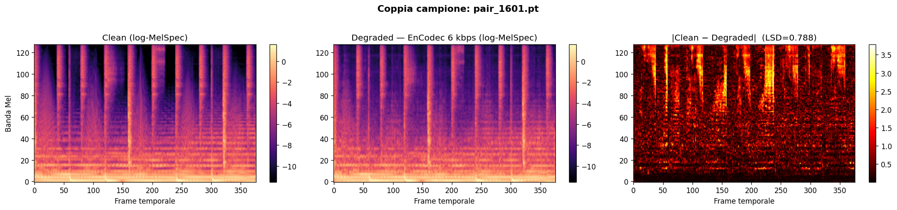

# Audio Restoration for MusicGen outputs

Audio generato da MusicGen porta con sé artefatti introdotti dal codec neurale EnCodec (quantizzazione RVQ a 6 kbps), percepibili come smorzamento delle alte frequenze e distorsioni temporali. Questo progetto addestra una **U-Net 2D su mel spectrogrammi** per mappare l'audio degradato verso la versione clean, usando come vocoder finale **Vocos** per risintetizzare la forma d'onda. Il modello è progettato per girare su Google Colab T4 e il dataset è costruito automaticamente da FMA-small tramite la pipeline di degradazione EnCodec.

---

## Pipeline

```
MusicGen raw output
       │
       ▼
  EnCodec 24kHz        ← degrada l'audio (RVQ 6 kbps, 8 codebook)
  encode → decode
       │
       ▼
  log-MelSpectrogram   ← [1, 128, T]  clean  +  degraded
       │
       ▼
    U-Net 2D           ← impara a rimuovere gli artefatti nel dominio spettrale
       │
       ▼
     Vocos             ← vocoder neurale: mel → forma d'onda 24kHz
       │
       ▼
  Audio restaurato
```

---

## Struttura repository

```
audio-restoration-musicgen/
│
├── notebooks/
│   ├── 00_proof_of_concept.ipynb   # verifica che il problema esista e sia misurabile
│   ├── 01_data_pipeline.ipynb      # scarica FMA-small, degrada con EnCodec, salva coppie .pt
│   ├── 02_training.ipynb           # addestramento U-Net su Google Colab T4
│   ├── 03_inference.ipynb          # restauro di un file audio con il modello addestrato
│   └── 04_evaluation.ipynb         # metriche quantitative (LSD, SI-SDR, MOS proxy)
│
├── src/                            # moduli Python riusabili (model, dataset, losses)
│
├── results/
│   ├── figures/                    # immagini salvate dai notebook
│   └── audio/                      # campioni audio di output
│
├── CLAUDE.md                       # istruzioni per Claude Code (non tracciato in git)
└── README.md
```

---

## Come riprodurre

Tutti i notebook sono pensati per **Google Colab con GPU T4**. Eseguirli nell'ordine numerato.

### 0. Proof of Concept
```
notebooks/00_proof_of_concept.ipynb
```
Verifica che EnCodec introduca artefatti misurabili su un singolo file audio. Non richiede Google Drive.

### 1. Data Pipeline
```
notebooks/01_data_pipeline.ipynb
```
- Monta Google Drive e crea la cartella `audio-restoration/data/train/`
- Scarica FMA-small (~7.2 GB) dal server ufficiale; fallback automatico su HuggingFace Hub
- Degrada ogni traccia con EnCodec 24kHz @ 6kbps e salva le coppie come `pair_XXXX.pt`
- **Output:** 2000 coppie `{clean_mel, degraded_mel}` su Google Drive

> Il loop supporta resume automatico: se interrotto, ri-eseguire la cella 6 riparte da dove si era fermato.

### 2. Training *(in sviluppo)*
```
notebooks/02_training.ipynb
```
Addestramento U-Net 2D con loss combinata (L1 + spettrale). Checkpoint salvati su Drive ogni epoca.

### 3. Inference *(in sviluppo)*
```
notebooks/03_inference.ipynb
```
Carica un checkpoint, restaura un file `.mp3` o `.wav` e salva l'audio risultante.

### 4. Evaluation *(in sviluppo)*
```
notebooks/04_evaluation.ipynb
```
Calcola LSD, SI-SDR e MOS proxy sul test set e genera i grafici finali.

---

## Dataset

**FMA-small** — Free Music Archive, subset da 8000 tracce MP3 128kbps (~30s), 8 generi bilanciati.

- Licenza: Creative Commons
- Download automatico da: `https://os.unil.ch/fma/fma_small.zip`
- Fallback: [`Dragunflie-420/FMADataset`](https://huggingface.co/datasets/Dragunflie-420/FMADataset) su HuggingFace Hub
- Alternativa manuale: disponibile anche via **Kaggle API** (`kaggle datasets download -d imsparsh/fma-free-music-archive-small-medium`)

---

## Stack

| Componente | Versione |
|---|---|
| Python | 3.10 |
| PyTorch | ≥ 2.1 |
| torchaudio | ≥ 2.1 |
| encodec | 0.1.1 |
| Vocos | *(02_training)* |
| Esecuzione | Google Colab T4 |

---

## Risultati Preliminari

### Proof of Concept — Degradazione EnCodec


Confronto mel spectrogram clean vs degradato da EnCodec 24kHz 6kbps su un file di musica classica. LSD = **5.76 dB**.

### Data Pipeline — Coppia campione dal dataset



Esempio di coppia (clean, degraded) dal dataset di training. LSD = **0.696**. Shape tensori: `[1, 128, 376]`. Dataset totale: **2000 coppie**.

> LSD medio più basso nella pipeline rispetto al proof of concept perché FMA-small include generi con densità spettrale più omogenea (folk, hip-hop, elettronica) rispetto alla musica classica, che ha picchi dinamici più estremi.
